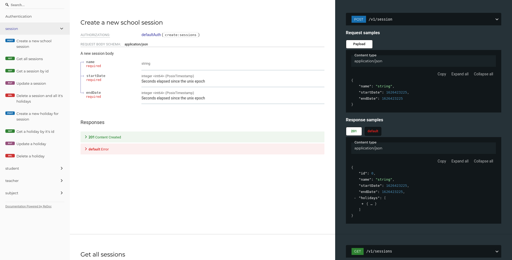

+++
title = "The Classroom Manager Refresh"
date = 2021-07-26
draft = false

[taxonomies]
categories = ["Projects"]
tags = ["projects", "backend web development", "frontend web development", "REST APIs", "Functional Programming", "F#","Typescript", "React"]
+++

It has bugged me for a very very long time about how the classmanager turned out
so I decided very recently that it was time for a classroom manager refresh. I
decided it was time to showcase what 2 years more of experience looked like. I
wanted to go deeper in what my strengths were as a programmer, do a bit of
functional reactive programming in react for the frontend. I also wanted to
showcase my planning skills and railway oriented chops with using frameworks
such as F# giraffe (A railway oriented abstraction of vanilla asp.net). I also
wanted to showcase planning with redoc.

<!-- more -->

# Description

As of writing this it is only in the planning phase, very little code has been
written. A big change was made migrating from parcel which I have used
extensively for projects in elm and react, to webpack. The reason for this
switch is because depending how I go I might want to also use rust and web
assembly to write the front end. I was getting errors building with parcel v1,
it was fixed in parcel v2 but as of parcel v2 there is no web assembly support.
Webpack seemed like the right choice even if it was a massive pain in the ass.

Originally I had planned to serve the api docs on the front end, but I had
trouble integrating redoc or swagger into the front end stack. Instead I used
the redoc cli to generate a static html page with everything included and
created a route and a handler on the back end for serving it.

```fs
// ---------------------------------
// Web app
// ---------------------------------

let webApp =
    choose [ subRoute
                 "/api/v1"
                 (choose [ GET
                           >=> choose [ route "/hello" >=> handleGetHello
                                        route "/spec" >=> handleSpec ] ])
             setStatusCode 404 >=> text "Not Found" ]

```

```fs
let handleSpec =
    fun (next: HttpFunc) (ctx: HttpContext) ->
        task { return! ctx.WriteHtmlFileAsync @"../../docs/api/redoc-static.html" }
```

With this in mind, part of the reason that very little progress has been made on
the project so far is the scope of the project. While it seems very small, it is
not. At the time of writing this description the api spec is about 1/3 done and
is ~1000 lines.

```yaml
openapi: 3.0.0
info:
  version: 1.0.0
  title: Classroom Manager API
servers:
  - description: Local Development Server
    url: "http://localhost:4000/api"
paths:
  /v1/session:
    post:
      summary: "Create a new school session"
      operationId: createSession
      tags:
        - session
      security:
        - defaultAuth:
            - "create:sessions"
      requestBody:
        description: "A new session body"
        required: true
        content:
          application/json:
            schema:
              $ref: "#/components/schemas/SessionMutation"
      responses:
        201:
          description: "Content Created"
          content:
            application/json:
              schema:
                $ref: "#/components/schemas/Session"
        default:
          $ref: "#/components/responses/ErrorResponse"
  /v1/sessions:
    get:
      summary: "Get all sessions"
      operationId: getAllSessions
      tags:
        - session
      security:
        - defaultAuth:
            - "read:sessions"
      parameters:
        - in: query
          name: date
          description: "A date that a school session is within"
          schema:
            $ref: "#/components/schemas/PosixTimestamp"
      responses:
        200:
          description: "Success"
          content:
            application/json:
              schema:
                type: array
                items:
                  $ref: "#/components/schemas/Session"
        default:
          $ref: "#/components/responses/ErrorResponse"
  /v1/session/{id}:
    get:
      summary: "Get a session by id"
      operationId: getSessionById
      tags:
        - session
      security:
        - defaultAuth:
            - "read:sessions"
      parameters:
        - in: path
          name: id
          description: "Session ID"
          required: true
          schema:
            type: integer
            format: int64
      responses:
        200:
          description: "Success"
          content:
            application/json:
              schema:
                $ref: "#/components/schemas/Session"
        default:
          description: "Error"
          content:
            application/json:
              schema:
                $ref: "#/components/schemas/Error"
    put:
      summary: "Update a session"
      operationId: updateSession
      tags:
        - session
      security:
        - defaultAuth:
            - "update:sessions"
      parameters:
        - in: path
          name: id
          description: "Session ID"
          required: true
          schema:
            type: integer
            format: int64
      requestBody:
        description: "A session with updated fields"
        required: true
        content:
          application/json:
            schema:
              $ref: "#/components/schemas/SessionMutation"
      responses:
        200:
          description: "Success"
          content:
            application/json:
              schema:
                $ref: "#/components/schemas/Session"
        default:
          $ref: "#/components/responses/ErrorResponse"
    delete:
      summary: "Delete a session and all it's holidays"
      operationId: deleteSession
      tags:
        - session
      security:
        - defaultAuth:
            - "delete:sessions"
      parameters:
        - in: path
          name: id
          description: "Session ID"
          required: true
          schema:
            type: integer
            format: int64
      responses:
        204:
          description: "Success No Content"
        default:
          $ref: "#/components/responses/ErrorResponse"
...
    Timetable:
      type: object
      required:
        - classes
        - classTimes
      properties:
        classes:
          type: array
          items:
            $ref: "#/components/schemas/Class"
        classTimes:
          type: array
          items:
            $ref: "#/components/schemas/ClassTimetable"
    Error:
      type: object
      required:
        - code
        - message
      properties:
        code:
          type: string
          enum:
            - NOT_AUTHORISED
            - FORBIDDEN
            - NOT_FOUND
            - CLIENT_ERROR
            - SERVER_ERROR
        message:
          type: string
        errors:
          type: array
          items:
            type: object
            required:
              - message
              - field
            properties:
              message:
                type: string
              field:
                type: string
  responses:
    ErrorResponse:
      description: "Error"
      content:
        application/json:
          schema:
            $ref: "#/components/schemas/Error"
```

## Screenshots



## Sources

<https://gitlab.com/BebopBamf/ClassroomManager>

<https://gitlab.com/BebopBamf/classroom-manager-site>
