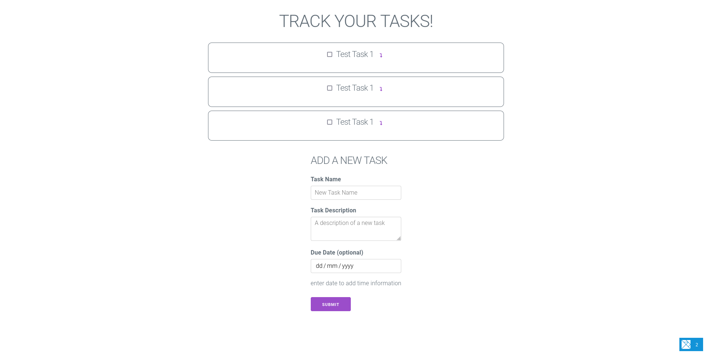

+++
title = "The Tasks App"
date = 2021-07-20
draft = false

[taxonomies]
categories = ["Projects"]
tags = ["projects", "Functional Programming", "Functional Reactive Frontends", "Railway Oriented Programming", "Elixir", "Rust", "Elm"]
+++

The tasks application stemmed from my functional programming background and a
book "Elixir and Elm". I wanted to showcase some functional programming stacks
that would be cool to use in the real world.

<!-- more -->

# Description

As mentioned before the entire point of the tasks application was to showcase
functional stacks. It was partly based off a previous example api I had done
before called 'The assignment api' which allowed students to play with an api
and practice web development. It was also based off the original todo
application written for the sysadmin workshop.

For the project the first thing I did was create a
[specification for the api](https://app.swaggerhub.com/apis-docs/BebopBamf/Tasks/1.0.0).
After which I created a elixir backend. This elixir backend was really nothing
special since the aim was to showcase how easy it was to use elixir, and the
code was almost fully autogenerated. I think I only deleted a field from the
validate required part off the application.

```elixir
defmodule TasksApi.Tasks.Task do
  use Ecto.Schema
  import Ecto.Changeset

  schema "task" do
    field :name, :string
    field :description, :string
    field :due_date, :naive_datetime
    field :is_complete, :boolean, default: false

    timestamps()
  end

  @doc false
  def changeset(task, attrs) do
    task
    |> cast(attrs, [:name, :description, :due_date, :is_complete])
    |> validate_required([:name, :description, :is_complete])
  end
end
```

When we decided to have zero dependancies in our devops_primer deployment, we
changed the code to rust. Even though as a programming language some would say
that rust is less functional, I ended up using a very functional style for error
handling, involving pattern matching and monads. To do this I created a client
facing error type, and used the Result type (Either Monad in Haskell) to
transform database, or json errors into the client facing http errors. Thus
conforming to the principles and ideas of railway oriented programming even if
it was not written in FSharp or Haskell.

```rust
use actix_web::{dev::HttpResponseBuilder, error, http::StatusCode, HttpResponse};
use derive_more::{Display, Error};
use serde::Serialize;

#[derive(Debug, Display, Error, Serialize)]
pub enum ErrorCodes {
    #[display(fmt = "Invalid ID")]
    InvalidId,

    #[display(fmt = "Invalid Input")]
    InvalidInput,

    #[display(fmt = "Internal Server Error")]
    InternalServerError,
}

#[derive(Debug, Display, Error, Serialize)]
#[display(fmt = "{}: {}", code, msg)]
pub struct ClientError {
    code: ErrorCodes,
    msg: String,
}

impl ClientError {
    pub fn new(code: ErrorCodes, msg: String) -> ClientError {
        ClientError { code, msg }
    }
}

impl error::ResponseError for ClientError {
    fn status_code(&self) -> StatusCode {
        match self.code {
            ErrorCodes::InvalidId => StatusCode::NOT_FOUND,
            ErrorCodes::InvalidInput => StatusCode::BAD_REQUEST,
            ErrorCodes::InternalServerError => StatusCode::INTERNAL_SERVER_ERROR,
        }
    }

    fn error_response(&self) -> HttpResponse {
        HttpResponseBuilder::new(self.status_code()).json(self)
    }
}
```

```rust
#[put("task/{id}")]
pub async fn update_task(
    id: web::Path<i32>,
    new_task: web::Json<NewTask>,
    db_pool: web::Data<PgPool>,
) -> Result<HttpResponse, ClientError> {
    let result = Task::update(id.into_inner(), &new_task.into_inner(), db_pool.get_ref())
        .await
        .map_err(|e| {
            info!("database error: {}", e);
            match e {
                Error::RowNotFound => ClientError::new(
                    ErrorCodes::InvalidId,
                    "Incorrect id specified, could not find task".to_string(),
                ),
                _ => ClientError::new(
                    ErrorCodes::InternalServerError,
                    "Something went wrong with the database".to_string(),
                ),
            }
        })?;

    Ok(HttpResponse::Ok().json(result))
}
```

```rust
HttpServer::new(move || {
        let cors = Cors::default().allow_any_origin();

        App::new()
            .wrap(Logger::default())
            .wrap(cors)
            .data(db_pool.clone())
            .app_data(web::JsonConfig::default().error_handler(|err, _req| {
                let msg = match err {
                    JsonPayloadError::Overflow => "Request is too large.".to_string(),
                    JsonPayloadError::ContentType => {
                        "Cannot process this content, invalid format.".to_string()
                    }
                    JsonPayloadError::Deserialize(_) => "Incorrect Syntax applied".to_string(),
                    JsonPayloadError::Payload(_) => {
                        "Something went wrong communicating with the server.".to_string()
                    }
                };
                ClientError::new(ErrorCodes::InvalidInput, msg).into()
            }))
            .service(handlers::create_task)
            .service(handlers::read_all_tasks)
            .service(handlers::read_task_by_id)
            .service(handlers::update_task)
            .service(handlers::delete_task)
    })
    .bind(access_point)?
    .run()
    .await?;
```

For the client side, originally mean't to be a simple single file elm
application, I guess I did not realise how much code was involved in writing
a simple task tracker front end. Being Elm it utilised Functional Reactive
Programming to handle state and changes. The Model-View-Update model made it
very easy to debug and refactor, whilst the biggest challenge was writing
the javascript components, originally trying to use web assembly and realising
that just using plain javascript was optimal. I think in reality the benefit of
writing code in elm requires experience with javascript and trying to debug it.
Elm code breaks at compile time rather then at runtime and the error messages
are so much easier to understand. Rather then a stack trace that says expected
an object with absolutely no context, elm shows you where the program is failing
and why.

`Main.elm`

```elm
module Main exposing (..)

import Browser
import Html exposing (Html, div, h1, h3, text)
import Html.Attributes exposing (class)
import Html.Lazy exposing (lazy)
import Http
import Json.Decode as Decode
import NewTask
import Task
import Tasks exposing (TaskType)
import Time


-- MODEL --


type alias Model =
    { status : Status
    , zone : Time.Zone
    , new_task : NewTask.Model
    }


type Status
    = Failure
    | Loading
    | Success (List Tasks.Model)


init : () -> ( Model, Cmd Msg )
init _ =
    let
        getTasksMsg =
            Cmd.map HttpMsgs getAllTasks
    in
    ( Model Loading Time.utc (NewTask.Model "" "" Nothing)
    , Cmd.batch [ setTimezone, getTasksMsg ]
    )


setTimezone : Cmd Msg
setTimezone =
    Task.perform AdjustTimeZone Time.here


-- UPDATE --


type Msg
    = AdjustTimeZone Time.Zone
    | HttpMsgs HttpMsg
    | TaskMsgs Tasks.Msg
    | NewTaskMsgs NewTask.Msg


type HttpMsg
    = Received (Result Http.Error (List TaskType))
    | Waiting


mapUpdate : (msg -> Msg) -> ( m, Cmd msg ) -> ( m, Cmd Msg )
mapUpdate toMsg ( model, cmd_msg ) =
    ( model, Cmd.map toMsg cmd_msg )


update : Msg -> Model -> ( Model, Cmd Msg )
update msg model =
    case msg of
        AdjustTimeZone newZone ->
            ( { model | zone = newZone }
            , Cmd.none
            )

        HttpMsgs httpMsgs ->
            mapUpdate HttpMsgs (updateHttp httpMsgs model)

        TaskMsgs taskMsgs ->
            mapUpdate TaskMsgs (updateTask taskMsgs model)

        NewTaskMsgs newTaskMsgs ->
            let
                ( newTask, cmdMsgs ) =
                    mapUpdate
                        NewTaskMsgs
                        (NewTask.update newTaskMsgs model.new_task)
            in
            ( { model | new_task = newTask }, cmdMsgs )


updateHttp : HttpMsg -> Model -> ( Model, Cmd HttpMsg )
updateHttp msg model =
    case msg of
        Waiting ->
            ( { model | status = Loading }, getAllTasks )

        Received result ->
            case result of
                Ok tasks ->
                    let
                        taskModel =
                            List.map (Tasks.Model True) tasks
                    in
                    ( { model | status = Success taskModel }, Cmd.none )

                Err _ ->
                    ( { model | status = Failure }, Cmd.none )


updateTask : Tasks.Msg -> Model -> ( Model, Cmd Tasks.Msg )
updateTask msg model =
    case model.status of
        Success tasks ->
            let
                ( updated_tasks, cmd_msg ) =
                    Tasks.update msg tasks
            in
            ( { model | status = Success updated_tasks }
            , cmd_msg
            )

        _ ->
            ( model, Cmd.none )


-- VIEW --


toView : (msg -> Msg) -> Html msg -> Html Msg
toView toMsg viewer =
    Html.map toMsg viewer


view : Model -> Html Msg
view model =
    div [ class "main" ]
        [ viewTitle
        , lazy viewTasks model
        , toView NewTaskMsgs (NewTask.view model.new_task)
        ]


viewTitle : Html Msg
viewTitle =
    h1 [] [ text "TRACK YOUR TASKS!" ]


viewTasks : Model -> Html Msg
viewTasks model =
    case model.status of
        Failure ->
            h3 [] [ text "Error, could not connect to api" ]

        Loading ->
            h3 [] [ text "Loading..." ]

        Success tasks ->
            toView TaskMsgs (Tasks.view model.zone tasks)


-- HTTP --


apiURL : String
apiURL =
    "https://api.howgood.me"


getAllTasks : Cmd HttpMsg
getAllTasks =
    Http.get
        { url = apiURL ++ "/tasks"
        , expect = Http.expectJson Received (Decode.list taskDecoder)
        }


-- JSON --


taskDecoder : Decode.Decoder TaskType
taskDecoder =
    Decode.map5 TaskType
        (Decode.field "id" Decode.int)
        (Decode.field "name" Decode.string)
        (Decode.field "description" Decode.string)
        (Decode.field "due_date" (Decode.maybe timeDecoder))
        (Decode.field "is_complete" Decode.bool)


timeDecoder : Decode.Decoder Time.Posix
timeDecoder =
    Decode.map Time.millisToPosix Decode.int


-- MAIN --


main : Program () Model Msg
main =
    Browser.element
        { init = init
        , update = update
        , view = view
        , subscriptions = \_ -> Sub.none
        }
```

`Tasks.elm`

```elm
module Tasks exposing (Model, Msg, TaskType, update, view)

import Html exposing (Html, button, div, h4, i, input, p, text)
import Html.Attributes exposing (checked, class, hidden, type_)
import Html.Events exposing (onClick)
import Html.Keyed as Keyed
import Html.Lazy exposing (lazy3)
import Time


-- MODEL --


type alias Model =
    { displayExtra : Bool
    , task : TaskType
    }


type alias TaskType =
    { id : Int
    , name : String
    , description : String
    , dueDate : Maybe Time.Posix
    , isComplete : Bool
    }


-- UPDATE --


type Msg
    = ToggleDisplayExtra Int Bool
    | ToggleComplete Int Bool


applyToTask : (TaskType -> TaskType) -> Model -> Model
applyToTask f model =
    { model | task = f model.task }


update : Msg -> List Model -> ( List Model, Cmd Msg )
update msg model =
    case msg of
        ToggleDisplayExtra id displayExtra ->
            let
                toggleDisplayExtra m =
                    if m.task.id == id then
                        { m | displayExtra = displayExtra }

                    else
                        m
            in
            ( List.map toggleDisplayExtra model
            , Cmd.none
            )

        ToggleComplete id isComplete ->
            let
                toggleComplete t =
                    if t.id == id then
                        { t | isComplete = isComplete }

                    else
                        t
            in
            ( List.map (applyToTask toggleComplete) model
            , Cmd.none
            )


-- VIEW --


view : Time.Zone -> List Model -> Html Msg
view zone tasks =
    Keyed.node "ul" [] (List.map (viewKeyedTasks zone) tasks)


viewKeyedTasks : Time.Zone -> Model -> ( String, Html Msg )
viewKeyedTasks zone model =
    ( String.fromInt model.task.id
    , lazy3 viewTask zone model.task model.displayExtra
    )


viewTask : Time.Zone -> TaskType -> Bool -> Html Msg
viewTask zone task displayExtra =
    div [ class "task-content" ]
        [ div [ class "flex-row" ]
            [ input
                [ type_ "checkbox"
                , checked task.isComplete
                , onClick (ToggleComplete task.id (not task.isComplete))
                ]
                []
            , h4 [] [ text task.name ]
            , button
                [ class "button button-clear down-button"
                , onClick (ToggleDisplayExtra task.id (not displayExtra))
                ]
                [ i [ class "fas fa-level-down-alt" ] [] ]
            ]
        , div [ hidden displayExtra ]
            [ p [] [ text task.description ]
            , viewDueDate zone task.dueDate
            ]
        ]


viewDueDate : Time.Zone -> Maybe Time.Posix -> Html Msg
viewDueDate timezone maybeTime =
    case maybeTime of
        Just time ->
            let
                year =
                    String.fromInt (Time.toYear timezone time)

                month =
                    displayMonth (Time.toMonth timezone time)

                day =
                    String.fromInt (Time.toDay timezone time)

                hour =
                    String.fromInt (Time.toHour timezone time)

                minute =
                    String.fromInt (Time.toMinute timezone time)
            in
            p []
                [ text
                    ("Due Date: "
                        ++ day
                        ++ "/"
                        ++ month
                        ++ "/"
                        ++ year
                        ++ " "
                        ++ hour
                        ++ ":"
                        ++ minute
                    )
                ]

        Nothing ->
            p [] [ text "Due Date not set" ]


displayMonth : Time.Month -> String
displayMonth month =
    case month of
        Time.Jan ->
            "1"

        Time.Feb ->
            "2"

        Time.Mar ->
            "3"

        Time.Apr ->
            "4"

        Time.May ->
            "5"

        Time.Jun ->
            "6"

        Time.Jul ->
            "7"

        Time.Aug ->
            "8"

        Time.Sep ->
            "9"

        Time.Oct ->
            "10"

        Time.Nov ->
            "11"

        Time.Dec ->
            "12"
```

## Screenshots



## Sources

<https://github.com/Macquarie-University-DSC/elm_elixir_workshop>

<https://github.com/Macquarie-University-DSC/tasks_api_rs>

<https://github.com/Macquarie-University-DSC/tasks-site>
